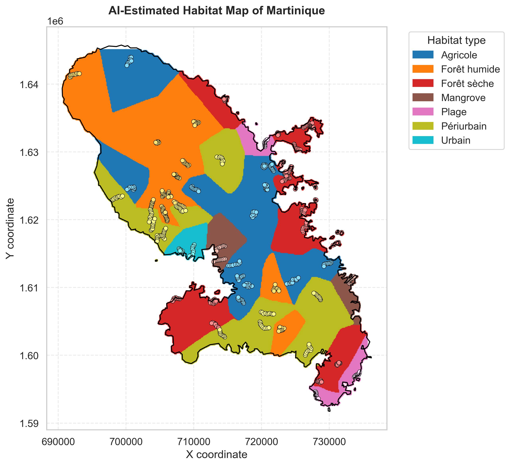

# Birds Biodiversity

```
   \\                       /""\      ,                       __                         ,_,
   (o>                     <>^  L____/|                      /'{>                       (O,O)
\\_//)                       `) /`   , /                ____) (____                     (   )
 \_/_)                        \ `---' /               //'--;   ;--'\\                   -"-"---
  _|_                          `'";\)`                ///////\_/\\\\\\\
                                _/_Y                        m m
```

An analysis of bird observations collected from 2012 to 2025 across several habitats. The notebooks clean the raw observation sheets, compute multi-year biodiversity indicators per habitat (richness, Shannon index, normalized abundance, origin of species) and model the evolution of species over time.

<p align="center">
  
</p>

The full analysis is in `Technical_Report.pdf`, and `dataset_overview.md` describes the data.

## Usage

```bash
pip install -r requirements.txt
```

Run the three notebooks in this order, executing every cell:

1. `data_preparation.ipynb`: cleans the Excel file and exports the tables to `data/processed/`;
2. `multi_year_indicators.ipynb`: computes the multi-year indicators;
3. `species_evolution.ipynb`: computes the trends of each species.

Always use the provided `data/raw/Observations 2012-2025.xlsx`: some errors of the original file were corrected in it, and the preprocessing expects its exact structure. All figures are saved in `figures/`.

## Authors

Raphael Leonardi and Baptiste Pras.
